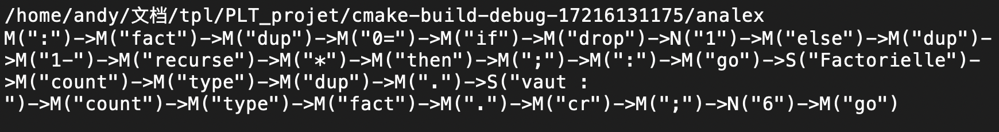

##  1. Introduction

### 1.1. Objectif

Ce projet a pour objectif d'écrire un compilateur pour un langage suffisamment simple permettant d'aborder les thèmes suivants:

- Analyse lexical
- Analyse syntaxique
- Analyse sémantique
- Interprétation
- Compilation en machine virtuelle
- Compilation en machine réelle

Le langage proposé est un langage inspiré du langage **Forth**. Nous l'appelerons **LAC**.


### 1.2. Environnement

Pour ce projet, un environnement **Linux** avec **gcc** de version *7.5.0*  est demandé. Les fichier exécutable se trouvent dans le dossier **PLT_build**. Par exemple, on peut entrer dans le terminal `./analex` dans ce dossier pour exécuter le fichier exécutable **analex** qui est compilé à partir du fichier **projet1.c**.

On peut recompiler les fichiers en entrant dans le terminal `make` dans le dossier **PLT_build**. Dans ce cas, le **cmake** de version supérieure à *3.0.0* est demandé. On peut aussi supprimer les fichiers exécutables en entrant `make clean` dans le terminal.


### 1.3. Description de fichiers

Les codes source de ce projet se trouvent dans le dossier **PLT_Projet** où les sous-dossiers sont comme suivants:

- **1_lex:** pour l'analyse lexicale dans **projet1**.
- **2_syn:** pour l'analyse syntaxique dans **projet2** et pour la fonction **calculateC**.
- **3_table:** pour les fonctions de base, le tableau LAC et le tableau VM dans **projet3**.
- **4_execute:** pour l'exécution d'un fichier **.lac** dans **projet4** et **projet5**.
- **tools:** pour les structures de données utilisées dans ce projet (la pile et l'arbre).
- **test:** pour tester le fonctionnement du programme.


## 2. Projet1 - Analyse lexicale

Cette partie est pour l'analyse lexicale des fichiesr **.lac** en utilisant **regex** dans **C**, qui se trouve dans le dossier **1_lex**.

Les lexèmes du langage **LAC** sont:

- **Entiers naturels (N).** 

  Expression régulière: `(0|[1-9][0-9]*)`.

- **Mot (M):** toute chaîne de caractère d’au moins un caractère, composée à l’aide des lettres, chiffres et symboles de ponctuation, sauf le caractère blanc [noté ␣]. 

  Expression régulière: `[^ "\n]+`.

- **Chaîne de caractères (S):** toute chaîne de caractère commençant par ␣"␣ (ou "␣ en début de ligne), ne contenant pas le caractère " à l’intérieur et se terminant par le caractère "). On fera attention qu’elle peut être sur plusieurs lignes et donc contenir des sauts de ligne.

  Expression régulière: `(^|\n| )" [^"]*"`.

- **Commentaire:** Les commentaires de ligne commencent par les caractères ␣\␣ [ou \␣ en début de ligne] et finissent en fin de ligne. Les commentaires multi-lignes commencent par les caractères ␣(␣ [ou (␣ en début de ligne] et se terminent par ).

  Expression régulière: `(^|\n| )\( [^\)]*\)|(^|\n| )\\ [^\n]*`.

On définie des structures pour les lexèmes:

```C
typedef struct lexeme {
    char type; // S(chaîne de caractères), N(entier naturel), M(mot)
    long beg;  // position de départ du lexème dans la chaîne de caractères en C du fichier
    long end;  // position du fin du lexème dans la chaîne de caractères en C du fichier
    char *content;  // contenu du lexème
} *pLexeme;

typedef struct LEX {
    long tableLen;     // longueur du tableau 
    pLexeme *pLexArr;  // tableau des lexèmes
} *pLEX;
```

On fait l'analyse lexicale d'abord pour les commentaires puis on les supprime (en les remplaçant par $-1$ dans la chaîne de caractères en **C**). Ensuite on fait la même chose pour les chaînes de caractères et les mots successivement. Il faut noter que pour un mot, par définition, il peut aussi être un entier naturel, donc on vérifie si c'est un entier naturel quand on rencontre un mot. Puis on va obtenir une chaîne de lexèmes sans ordre. À la fin, on range les lexèmes d'après leurs positions dans le fichier en utilisant l'algorithme **Tri rapide**.

L'analyse lexicale est réalisée dans la fonction **anaLex**:

```C
pLEX anaLex(char *fileStr);
```

Cette fonction prend une chaîne de caractères obtenue par un fichier **.lac**, puis renvoie un pointeur **pLEX** d'une structure **LEX** qui contient une chaîne de lexèmes.

On teste ce fonctionnement par **projet1.c** en analysant le fichier **factorielle.lac** dans le dossier **test**.

Le fichier **factorielle.lac:**

```
\ Fichier "factorielle.lac"

( Ce fichier est un "exemple" étudié pour tester
l'analyseur lexical écrit en phase 1 du projet)

: fact ( n -- n!)
    dup 0=
    if
        drop 1
    else 
        dup 1- recurse *
    then ;

: go ( n -- )
    " Factorielle" count type
    dup .
    " vaut :
" count type
    fact . cr ;

6 go

```

Pour l'exécution, on peut entrer dans le terminal `./analex` dans le dossier **PLT_build**. Puis on obtient le résultat de l'analyse lexicale:



On trouve que les commentaires sont supprimés, et que les entiers naturels (N), les mots (M) et les chaînes de caractères (S) sont bien distingués.


## 3. Projet2 - Analyse syntaxique & calculateC

Cette partie est pour l'analyse syntaxique des expressions mathématiques (notation infixée), et pour la réalisation d'une fonction **calculateC** en **C** qui calcule le résultat d'une expression mathématique. Cette partie se trouve dans le dossier **2_syn**.


### 3.1. Analyse syntaxique

Après une analyse lexicale spécialement pour l'expression mathématiques (réalisée dans la fonction **anaLexCal**), on va faire une analyse syntaxique pour les lexemes obtenus. Il faut noter que l'on traite seulement les <u>entiers naturels</u> dans **LAC**, donc avant l'analyse lexicale, on ajoute un zéro supplémentaire devant chaque entier négatif dans l'expression.

On introduit ici deux méthodes pour l'analyse syntaxique: **Grammaire BNF** et **Automate à pile**.

- **Grammaire BNF**

  L'expression mathématiques (où les entiers sont tous positifs) doit vérifier la grammaire BNF suivante:

  ```
  <chiffreNN> ::= 1"|"2"|"3"|"4"|"5"|"6"|"7"|"8"|"9"
  <chiffre> ::= "0" | <chiffreNN>
  <naturel> ::= <chiffre> | <chiffreNN> {<chiffre>}
  <operateur> ::= "+"|"-"|"x"
  <facteur> ::= <naturel> | "(" <somme> ")"
  <somme> ::= <facteur> | <somme> <operateur> <facteur>
  ```

  Donc pour une expression mathématique de notation infixée, on va vérifier si c'est un \<somme>. Sinon, on rencontrera une erreur dans l'analyse syntaxique.

- **Automate à pile**

  L'automate à pile est fourni comme suivant. L'état initial est l'état 0 et les états d'acceptation sont l'état 1, l'état 5 et l'état 6. Quand on rencontre une parenthèse ouvrante, on empile un élément $P$ et quand on rencontre une parenthèse fermante, on déplie un element $P$. À la fin, la pile doit être vide pour que l'expression soit correcte.

  

Dans ce projet, on utilise la grammaire BNF pour l'analyse syntaxique, qui est réalisée dans la fonction **anaSynCal**.


### 3.2. Fonction calculateC

Si on n'a pas d'erreur syntaxique dans l'expression mathématique, on peut calculer le résultat en utilisant un arbre syntaxique. Cet arbre peut être construit par l'algorithme suivante:

- On définit `maxPriority = 10` et on initialise `opPriority = 0`.

- On définit les priorités des opérateurs: $1$ pour `+` et `-`, $2$ pour `x`.

- On crée un nouveau nœud et on définit deux pointeurs `pNode` et `root` sur ce nœud.

- On lit lexème par lexème dans l'expression.

  - Si on rencontre une parenthèse ouvrante, alors `opPriority += maxPriority`.
  - Si on rencontre une parenthèse fermante, alors `opPriority -= maxPriority`.

  - Si on rencontre un entier naturel noté `num`, alors `pNode->value = num`.
  - Si on rencontre un opérateur, alors:
    - On crée un nouveau nœud `newNode` pour cet opérateur, et on définit `newNode->priority = priorité de l'opérateur + opPriority`.
    - On met le pointeur `pNode` sur son parent jusqu'à ce que `priorité du parent de pNode < newNode->priority` ou que `pNode == root`.
      - Si `pNode == root`, alors on met le pointeur `root` sur  `newNode` , on met l'arbre d'avant (`pNode`) comme l'enfant à gauche de  `newNode`, puis on crée un autre nouveau nœud comme l'enfant à droite de `newNode` et on met le pointeur `pNode` sur ce nouveau nœud.
      - Sinon, on remplace le sous-arbre de `pNode` par  `newNode`, et on met le sous-arbre de `pNode` comme l'enfant à gauche de  `newNode`. Puis on crée un autre nouveau nœud comme l'enfant à droite de `newNode` et on met le pointeur `pNode` sur ce nouveau nœud.

En appliquant cet algorithme sur une expression `"-(1-2)+(3-4)x(-5)"` qui est transformée en `"0-(1-2)+(3-4)x(0-5)"`, on peut avoir un arbre syntaxique comme suivant:


La formation de l'arbre basée sur une chaîne de lexemes est réalisée dans la fonction **formOpTree**. Pour calculer le résultat, on lit l'arbre syntaxique par la traversée en ordre, qui est réalisée dans la fonction **calculateOpTree**. Enfin, on réalise la fonction **calculateC** par la transformation de chaîne de caractères, l'analyse lexicale, l'analyse syntaxique, la formation d'arbre syntaxique et le calcul de l'arbre, successivement.

On teste ce fonctionnement par le fichier **projet2.c** dans le dossier **test** en utilisant l'expression `"-(1-2)+(3-4)x(-5)"`. Pour l'exécution, on peut entrer dans le terminal `./anasyn` dans le dossier **PLT_build**, et on obtient le résultat suivant:


## 4. Projet3 - Fonctions de base & tableaux LAC et VM

Cette partie est pour la réalisation des fonctions de base dans **LAC** et pour la construction des tableaux LAC et VM. Cette partie se trouve dans le dossier **3_table**.

On trouve dans le fichier **table.h** la déclaration des fonctions de base. Les détails du fonctionnement des ces fonctions de base peuvent être trouvés dans le fichier **table.c**.

```c
/// base functions
void plus();         // "+"
void minus();        // "-"
void multiply();     // "*"
void point();        // "."
void fin();          // "(fin)"
void lit();          // "(lit)"
void ifLac();        // "if"
void elseLac();      // "else"
void equal();        // "="
void dupLac();       // "dup"
void dropLac();      // "drop"
void swapLac();      // "swap"
void countLac();     // "count"
void typeLac();      // "type"
void calcLac();      // "calculate"
```

On définit dans le fichier **table.h** des structures pour les tableaux de LAC et VM comme suivantes:

```C
typedef struct LAC {
    int tableLen;    // longeur du tableau
    int funcNum;	 // nombre de fonctions de base/LAC
    int lastFuncIdx; // indice de la dernière fonction dans le tableau
    int lacArr[MAX_TABLE_LEN]; // tableau LAC
} *pLAC;

typedef struct VM {
    int tableLen;    // longeur du tableau
    int funcNum;	 // nombre de fonctions dans VM
    int vmArr[MAX_TABLE_LEN]; // tableau VM
} *pVM;
```

On définit aussi une structure pour le processeur:

```C
typedef struct PROC {
    int tableLen;    // longeur du tableau
    baseFunc procArr[MAX_TABLE_LEN]; // tableau du processeur
} *pPROC;
```

Puis on définit des fonctions pour construire ou utiliser les tableaux:

```C
// ajouter une fonction de base/LAC dans le tableau LAC
void addFuncToLAC(char *baseFuncName);

// ajouter une fonction de base dans le tableau VM
void addBaseFuncToVM();

// ajouter une fonction de base dans les tableaux LAC et VM
void declareBaseFunc(char *baseFuncName);

// initialiser les tableaux LAC, VM, PROC (et aussi STRING dans projet5)
// puis ajouter toutes les fonctions de base dans les tableaux LAC, VM et PROC
void tablesBuild();

// trouver le cfa d'une fonction de base/LAC
int findFuncCfa(const char *funcName);

// exécuter une fonction de base pour tester (juste pour cette partie)
void procBaseFunc(const char *funcName);
```

On teste le fonctionnement de certaines fonctions de base par le fichier **projet3.c** dans le dossier **test**. On gère la pile de données manuellement et on utilise la fonction **procBaseFunc** pour réaliser l'exécution de `2 3 4 * - 5 6 + * .`. Pour l'exécution, on peut entrer dans le terminal `./table` dans le dossier **PLT_build**, et on obtient le résultat suivant:


## 5. Projet4 - Exécution d'un fichier .lac

Cette partie est pour la réalisation de l'exécution d'un fichier **.lac**, elle se trouve dans le dossier **4_execute**.

On va maintenant expliquer les fonctions définies dans cette partie:

```C
int isLacFile(char *fileName);
```

La fonction **isLacFile** vérifie si le fichier est un fichier **.lac**. Sinon, on ne l'exécute pas.


```C
int executeVM(int cfa);
```

La fonction **executeVM** prend le cfa d'une fonction et exécute cette fonction dans le tableau VM. On distingue deux cas: une fonction de base et une fonction LAC. Supposons que l'on exécute une fonction de cfa $x$.

- Si `VM[x] == -1`, c'est une fonction de base.
  - On exécute `Processor[VM[x+1]]()`.
  - On vérifie si la pile de retour est vide:
    - Si elle est vide, on finit l'exécution.
    - Sinon, on dépile un élément $y$ dans la pile de retour, on empile $y+1$, et on exécute la fonction de cfa `VM[y+1]`.

- Si `VM[x] == -2`, c'est une fonction LAC.
  - On empile $x+1$, et on exécute la fonction de cfa `VM[x+1]`.


```C
int checkExpr(pLEX tableLEX);
```

La fonction **checkExpr** vérifie si les nombres de `:` et `;` sont égaux, et s'ils sont dans un ordre correct. Elle vérifie aussi `if` et `then` dans une structure conditionnelle qui va être discutée dans **Projet5**.


```C
long addToVM(pLEX tableLEX, long i);
```

La fonction **addToVM** ajoute des éléments dans VM d'après le lexème d'indice `i`. On distingue trois cas:

- Si c'est un entier naturel (N), on ajoute le cfa de la fonction de base **(lit)** avant d'ajouter ce nombre dans VM.
- Si c'est un mot (M), on le considère comme une fonction LAC et on ajoute son cfa dans VM. (Si le mot est `if`, on exécute la fonction **addCondToVM** pour une structure conditionnelle, qui va être expliquée dans **Projet5**).
- Si c'est une chaîne de caractères (S), on fait les opérations qui vont être présentées dans **Projet5**.


```C
long checkDef(pLEX tableLEX, long wIdx);
```

La fonction **checkDef** vérifie si la définition d'une fonction est correcte. Si la définition est correcte, cette fonction renvoie le dernier indice de lexème dans cette définition. Sinon, elle renvoie $-1$.

On utilise dans **LAC** `: Nom <Code> ;` pour définir une fonction LAC. On remarque que:

- Le nom d'une fonction LAC doit être un mot (M).
- On ne peut pas définir de nouveau une fonction de base.
- On ne peut pas définir une nouvelle fonction dans la définition d'une autre fonction.
- Si un lexème dans la partie `<Code>` est un mot (M), on le considère comme une fonction de base/LAC. Cette fonction doit être déjà définie (Maintenant on n'admet pas encore la définition par récursivité).
- La structure conditionnelle dans la définition doit être correcte (On le discutera dans **Projet5**).


```C
void addLacFuncToVM(pLEX tableLEX, long wIdx, long idxFin);
```

La fonction **addLacFuncToVM** ajoute une fonction LAC dont le cfa est $-2$ dans VM.

Après avoir ajouté toute la partie `<Code>`, on ajoute le cfa de la fonction de base **(fin)** dans VM.

Si on n'a pas d'erreur trouvée par la fonction **checkDef**, on ajoute cette fonction dans le tableau LAC par la fonction **addFuncToLAC**, puis on l'ajoute dans VM par a fonction **addLacFuncToVM**. C'est le fonctionnement de la fonction **addLacFunc**.


```C
long executeWord(pLEX tableLEX, long wIdx);
```

La fonction **executeWord** traite un mot (M) dans la chaîne de lexèmes pendant l'exécution. Ce mot est considéré comme une fonction de base/LAC. On trouve d'abord le cfa de cette fonction.

- Si la fonction est déjà définie, on exécute `executeVM(cfa)`.
- Si le mot est `:` qui n'est pas définit, on exécute la fonction **addLacFunc** pour ajouter cette nouvelle fonction dans les tableaux LAC et VM.
- Sinon, la fonction n'est pas encore définie, on rencontrera une erreur sémantique.


```C
int executeLEX(pLEX tableLEX);
```

La fonction **executeLEX** est pour l'exécution d'une chaîne de lexèmes. On distingue trois cas:

- Si un lexème est un entier naturel (N), on l'empile dans la pile de données.
- Si un lexème est un mot (M), on exécute la fonction **executeWord** expliquée avant.
- Si un lexème est une chaîne de caractères (S), on fait les opérations qui vont être présentées dans **Projet5**.


```C
void executeFileLAC(char *fileName);
```

La fonction **executeFileLAC** est pour l'exécution d'un fichier **.lac**. Elle prend le nom d'un fichier et elle vérifie si c'est un fichier **.lac**. Si oui, elle fait l'analyse lexicale (**anaLex**), la vérification des expressions (**checkExpr**), et l'exécution de la chaîne de lexèmes (**executeLEX**) successivement.


## 6. Projet5 - Structure conditionnelle & chaîne de caractères

Cette partie est pour le traitement des structures conditionnelles et des chaînes de caractères. Elle se trouve aussi dans le dossier **4_execute**.


### 6.1. Structure conditionnelle

On définit deux fonctions **checkCond** et **addCondToVM** pour la structure conditionnelle.

```C
long checkCond(pLEX tableLEX, long ifIdx);
```

La fonction **checkCond** vérifie si l'expression d'une structure conditionnelle est correcte. Si l'expression est correcte, cette fonction renvoie le dernier indice de lexème (`then`) dans cette structure. Sinon, elle renvoie $-1$.

On utilise dans **LAC** `<cond> if <si vrai> else <si faux> then` ou  `<cond> if <si vrai> then`  pour une structure conditionnelle. Il faut noter que la structure conditionnelle n'est utilisable que pendant la compilation, c'est-à-dire dans la définition des fonctions LAC. On remarque que:

- On ne peut pas rencontrer plusieurs `else`.
- On ne peut pas rencontrer un `;` avant de rencontrer un `then`.
- On ne peut pas définir une nouvelle fonction dans la définition d'une autre fonction, donc on ne peut pas rencontrer `:` dans la structure conditionnelle.
- Si on rencontre un lexème qui est un mot (M), on le considère comme une fonction de base/LAC. Cette fonction doit être déjà définie.
- Si on rencontre un autre `if`, on exécute **checkCond** à partir de ce lexème par récursivité.


```C
long addCondToVM(pLEX tableLEX, long ifIdx);
```

La fonction **addCondToVM** est pour ajouter une structure conditionnelle dans VM. Dans cette fonction, on trouve d'abord l'indice de `then` (et de `else` s'il y en a un). Puis on ajoute dans VM les codes dans cette structure. On distingue deux cas: il y a un `else` dans la structure et il y en n'a pas. Les détails de l'ajout des codes peuvent être trouvés dans le fichier **execute.c**.

Après avoir définit ces deux fonctions, on peut les utiliser dans les fonctions **addToVM** et **checkDef** présentées avant dans **Projet4**.


### 6.2. Chaîne de caractères

On stocke les chaînes de caractères (S) de **LAC** dans une structure suivante qui est définie dans **table.h** dans le dossier **3_table**:

```C
typedef struct STRING {
    int tableLen;	// longeur de tableau
    int strArr[MAX_TABLE_LEN]; // tableau des chaînes de caractères en LAC
} *pSTRING;
```

Pour une chaîne de caractère (S), quand on la rencontre dans la chaîne de lexèmes en exécutant la fonction **executeLEX**, on empile sa longueur dans la pile de données. Ensuite on met cette longueur dans le tableau des chaînes de caractères, et on met dans le tableau les caractères de cette chaîne un par un.

Quand on veut ajouter dans VM une chaîne de caractères par la fonction **addToVM**, on ajoute le cfa de la fonction de base **(lit)** (même que le cas d'un nombre entier (N)) avant d'ajouter l'indice de cette chaîne de caractères dans VM. Puis on met cette chaîne dans le tableau des chaînes de caractères à partir de cet indice.


### 6.3. Tests pour l'exécution d'un fichier .lac

On peut tester les fonctionnements réalisés avant par le fichier **projet4.c** dans le dossier **test** en utilisant le fichier **test_exe.lac**.

Pour l'exécution, on peut entrer dans le terminal `./execute` dans le dossier **PLT_build**. Puis on obtient les résultats suivants:


**Analyse lexicale**


**Fonctions de base**

```
\ base function test
2 3 4 + * .
2 3 4 * - 5 6 + * .
```

Résultat:


**Definition des fonctions LAC**

```
\ function definition
: incr 1 + ;
: 2+. incr incr . ;
123 2+.

\ void function
: none ;
none
```

Résultat:


**Structure conditionnelle & chaîne de caractères**

```
\ condition definition
: 0= 0 = ;
: checkZero
    0=
    if
        " True!
" count type
    else
        " False!
" count type
    then " Finish checking.
" count type ;

\ condition test
3 - dup
" > Value in dataStack: " count type
.
" Check zero: " count type
checkZero
0 dup
" > Value in dataStack: " count type
.
" Check zero: " count type
checkZero
```

Résultat:


**Condition imbriquée (vérifier si on a deux zéros)**

```
\ nesting condition definition
: checkTwoZeros
    0=
    if
        " The second element is zero, checking the first element...
" count type
        0=
        if
            " The first element is zero, the result is True!
" count type
        else
            " The first element is not zero, the result is False!
" count type
        then
    else
        " The second element is not zero, checking the first element...
" count type
        0=
        if
            " The first element is zero, the result is False!
" count type
        else
            " The first element is not zero, the result is False!
" count type
        then
    then " Finish checking.
" count type ;

\ nesting condition test
1 - dup
" > First element in dataStack: " count type
.
0 dup
" > Second element in dataStack: " count type
.
checkTwoZeros
```

Résultat:


**Fonction calculate**

```
\ calculate
" > Calculate expression:
" count type
" -(1-2)+(3-4)x(-5)" dup count type
"  = " count type
calculate .
```

Résultat:


## 7. Résumé

Dans ce projet, on a réalisé un compilateur simple pour le langage **LAC**, qui permet de faire l'analyse lexicale, l'analyse syntaxique (pour une expression mathématique de notation infixée) et l'analyse sémantique pendant l'exécution. On peut faire l'interprétation et la compilation, et on peut traiter la structure conditionnelle et la chaîne de caractères.

Si on a plus de temps, on peut essayer la réalisation de la déclaration des variables, la récursivité, la boucle, etc.


